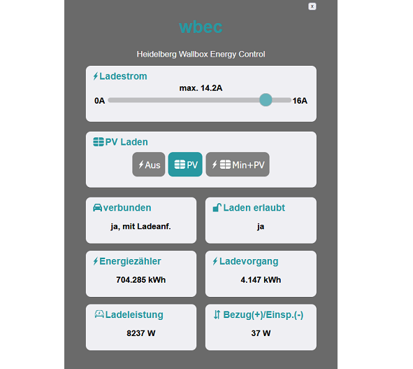
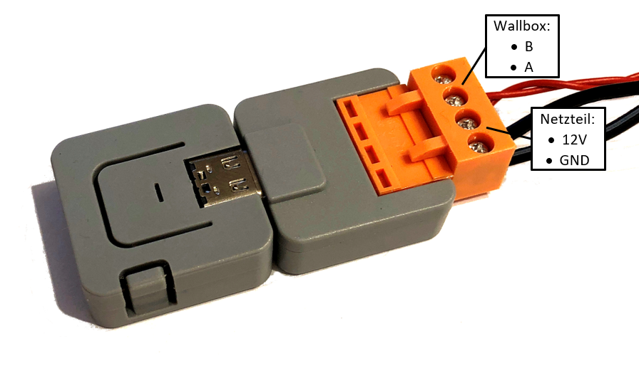
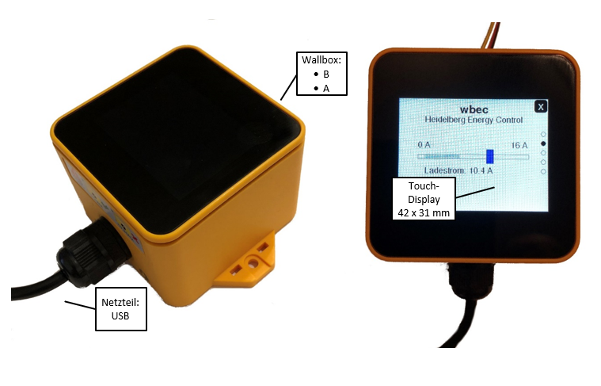

## wbec Software
wbec ist ein Erweiterungsmodul um die Heidelberg **W**all**b**ox **E**nergy **C**ontrol ins WLAN einzubinden. Die Wallbox ist dadurch über ein Webinterface per Browser erreichbar und kann um Funktionen wie z.B. PV-Überschussladen erweitert werden. Der Ladestrom kann einfach per Schieberegler begrenzt werden.  
  
  
wbec wird mit dem Modbus-RTU-Anschluss der Wallbox verbunden. Bauliche Veränderungen an der Wallbox sind nicht nötig.  

## wbecPro
Auf vielfachen Wunsch ist wbec jetzt auch als fertiges Modul verfügbar.  
Es wird einfach mittels Schraubklemmen mit dem Modbus-Anschluss der Wallbox verbunden. Zusätzlich wird ein normales 12V-Netzteil benötigt.

Um die Wallbox per WLAN zu erreichen, müsst ihr nur noch die Schalter in der Wallbox richtig einstellen (s. Anleitung) und eure WLAN-Zugangsdaten eintragen.

## wbecPremium
Optimal bedienen lässt sich wbec auch in der neuen Display-Variante. Somit kann der Ladestrom direkt eingestellt und die Werte wie die aktuelle Ladeleistung, etc. ausgelesen werden. In Kombination mit der PV-Funktion (s. Wiki) kann z.B. auch der Lademodus (Aus, PV, Min+PV) direkt am Display ausgewählt werden.   

Die Spannungsversorgung erfolgt per USB (Handyladegerät o.ä. erforderlich). Alternativ ist auch eine Umrüstung für 12V möglich. 

## Vergleich
|Technische Daten             |wbecPro         |wbecPremium             |
|:----------------------------|:---------------|:-----------------------|
|Grundfunktionen              | ja             | ja                     |
|Web-Interface                | ja             | ja                     |
|Touch-Display                | nein           | ja, 42 x 31 mm (2.0'') |
|RFID-Leser                   | nein           | nein                   |
|Flashspeicher                | 4MB            | 16MB                   |
|RAM                          | 520kB SRAM     | 520kb SRAM + 8MB PSRAM |
|künftige Erweiterbarkeit     | begrenzt       | Reserven vorhanden     |
|zul. Temperaturbereich       | 0°C bis 60°C   | 10°C bis 60°C          |
|Spannungsversorgung          | 12V (9-24V)    | 5V USB (ggf. 12V)      |
|Abmessungen (BxTxH)          | 58 x 24 x 12mm | 58 x 58 x 42mm (zzgl. Befestigungslaschen und Kabel) |
|Gehäuse im Lieferumfang      | nein           | integriert             |
|Angebot                      |[anfordern](mailto:wbec393@gmail.com?subject=Angebotsanfrage%20wbecPro&body=Hallo%20steff393,%0D%0A%0D%0Aich%20interessiere%20mich%20für%20wbecPro.%20Bitte%20sende%20mir%20ein%20Angebot%20zu.%0D%0Aggf.%20weitere%20Infos...)|[anfordern](mailto:wbec393@gmail.com?subject=Angebotsanfrage%20wbecPremium&body=Hallo%20steff393,%0D%0A%0D%0Aich%20interessiere%20mich%20für%20wbecPremium.%20Bitte%20sende%20mir%20ein%20Angebot%20zu.%0D%0Aggf.%20weitere%20Infos...)|

## Bezugsquelle
Die Module können bei mir bezogen werden:  
**Ingenieurbüro Stefan Ferstl**  
Hasenweg 7  
92339 Beilngries  
E-Mail: wbec393@gmail.com

Jedes Modul ist fertig programmiert und wurde individuell an meiner Heidelberg Energy Control getestet. Mit dabei ist eine Bedienungs- und Installationsanleitung als PDF und bei Fragen könnt ihr euch gern melden.

Lieferzeit: in der Regel 2-3 Tage nach Zahlungseingang, z.B. per Paypal  
